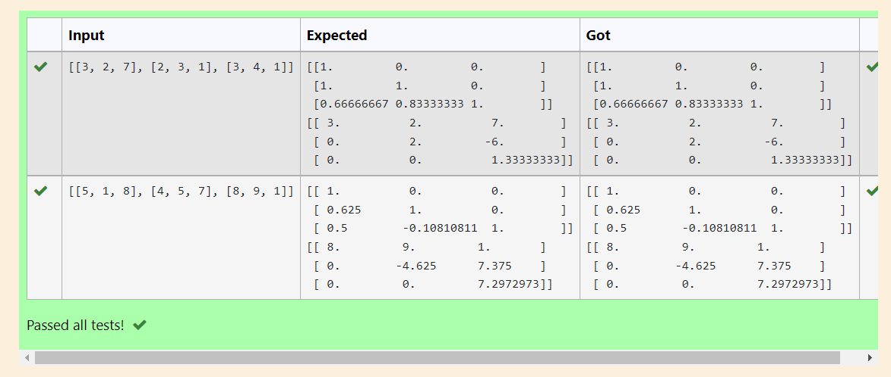
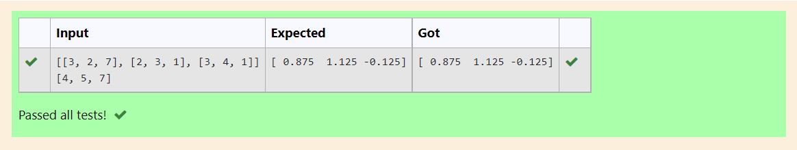

# 5.A) LU Decomposition without zero on the diagonal

## AIM:
To write a program to find the LU Decomposition of a matrix,
To find L and U.

## Equipments Required:
1. Hardware – PCs
2. Anaconda – Python 3.7 Installation / Moodle-Code Runner

## Algorithm
1. import numpy as np
2. From scipy package import lu
3. Get input from user
4. Print the result

## Program:
```
/*

Program to find the LU Decomposition of a matrix.
Developed by: Shrruthilaya G
RegisterNumber: 21002893

# To print L and U matrix
import numpy as np
from scipy.linalg import lu
#import scipy
#scipy.linalg.lu()
A=np.array(eval(input()))
P,L,U=lu(A)
print(L)
print(U)

*/
```

## Output:


## Result:
Thus the program to find the LU Decomposition of a matrix is written and verified using python programming.

# 5.B) LU Decomposition without zero on the diagonal

## AIM:
To write a program to find the LU Decomposition to solve the matrix.

## Equipments Required:
1. Hardware – PCs
2. Anaconda – Python 3.7 Installation / Moodle-Code Runner

## Algorithm
1. import numpy as np
2. From scipy package import lu_factor,lu_solve
3. Get input from user
4. Print the result

## Program:
```
/*

Program to find the LU Decomposition of a matrix.
Developed by: Shrruthilaya G
RegisterNumber: 21002893

'''Program to solve a matrix using LU decomposition.
Developed by: Shrruthilaya G
RegisterNumber: 21002893
'''

# To print X matrix (solution to the equations)
import numpy as np
from scipy.linalg import lu_factor, lu_solve
A=np.array(eval(input()))
B=np.array(eval(input()))
lu,pivot=lu_factor(A)
x=lu_solve((lu,pivot),B)
print(x)

*/
```

## Output:


## Result:
Thus the program to find the LU Decomposition of a matrix is written and verified using python programming.


